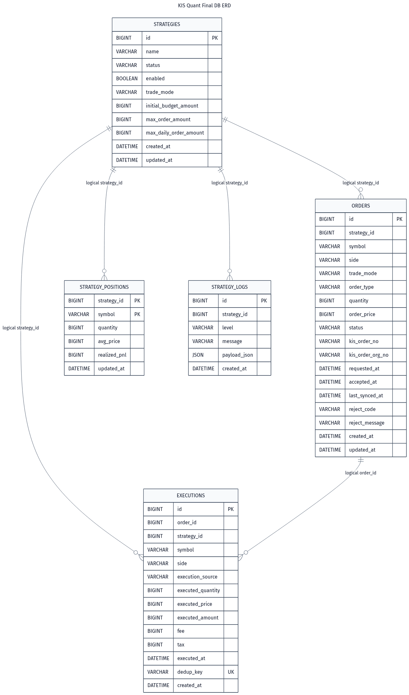

# 최종 DB 설계

polling을 고려할 것.
KIS에 주기적으로 주문/체결 상태를 다시 물어봐야만 함. 주문 완료와 체결을 구분할 것.

## 1. 도메인과 DB 기준

모든 투자 데이터를 쌓는 DB로 설계하지 않는다.
실전 주문 흐름을 복구하고
체결을 중복 없이 반영하고
전략별 내부 상태를 관리하는 것을 목표로 함.

그래서 DB는 다음 질문에 답할 수 있어야 한다.
- 어떤 전략이 주문을 냈는가
- 그 주문은 `SIMULATION`이었는가, `LIVE`였는가
- KIS 주문번호를 받았는가
- timeout 때문에 실제 접수 여부가 애매한가
- 어떤 체결을 이미 반영했는가
- 전략별 현재 보유 수량과 평균 단가는 얼마인가
- 전략이 어떤 판단과 실행 로그를 남겼는가

반대로 다음은 최종 DB에 넣지 않는다.

```text
accounts
account_snapshots
candles
instruments
capital_ledger
portfolio_snapshots
strategy_signal_details
```

캔들은 KIS API로 조회해서 DTO로 처리한다.
종목 마스터도 지금은 만들지 않는다.
복잡한 자본 원장도 만들지 않는다.

초기 목적은 데이터 플랫폼이 아니라 Live 주문 흐름을 안전하게 운영하는 것이다.


## 2. 최종 테이블

최종 테이블은 5개다.

```text
strategies
orders
executions
strategy_positions
strategy_logs
```

각 테이블의 역할은 다음과 같다.

| 테이블 | 역할 |
| --- | --- |
| `strategies` | 전략 설정, 실행 가능 여부, 투자 모드 |
| `orders` | Spring이 접수한 주문과 KIS 주문 상태 |
| `executions` | LIVE/SIMULATION 체결 내역 |
| `strategy_positions` | 전략별 현재 보유 상태 |
| `strategy_logs` | 전략 판단과 운영 로그 |

`orders`, `executions`, `strategy_positions`가 거래 복구의 중심이다.
`strategy_logs`는 사람이 운영 흐름을 확인하기 위한 기록이다.


## 3. ERD

아래 ERD는 논리 ERD다.

현재 최종 migration에는 물리 FK가 없다.
즉, `strategy_id`, `order_id` 관계는 DB FK constraint가 아니라 application과 repository adapter에서 맞춘다.




## 4. 왜 물리 FK를 두지 않는가

운영 안정성만 보면 FK를 거는 선택도 가능하지만
- JPA Entity를 단순하게 유지하고
- `@ManyToOne` 같은 객체 그래프를 일단 만들지 않고
- domain과 persistence adapter 사이 변환을 명확히 하고
- seed 전략과 수동 주문 테스트 흐름을 단순하게 유지하는 걸 목표로 한다.

주의할 점:
- DB가 잘못된 `strategy_id`, `order_id`를 직접 막아주지는 않는다.
- 그래서 repository test와 application service 흐름이 중요하다.
- 운영 중 직접 SQL로 데이터를 수정하는 일은 피해야 한다.


## 5. strategies

전략 설정을 저장한다.
```sql
CREATE TABLE strategies (
    id BIGINT NOT NULL,
    name VARCHAR(100) NOT NULL,
    status VARCHAR(30) NOT NULL,
    enabled BOOLEAN NOT NULL,
    trade_mode VARCHAR(30) NOT NULL,
    initial_budget_amount BIGINT NOT NULL,
    max_order_amount BIGINT NOT NULL,
    max_daily_order_amount BIGINT NOT NULL,
    created_at DATETIME(6) NOT NULL,
    updated_at DATETIME(6) NOT NULL,
    PRIMARY KEY (id)
) ENGINE=InnoDB;
```

### 왜 필요한가

전략은 Python 코드 자체가 아니다.

Spring이 알아야 하는 전략 정보는 다음이다.

- 지금 주문 가능한 전략인가(등록된 전략이 레거시한 전략일 수도 있고, 로직상 스프링 차원에서 주문 가능을 한 번 더 확인할 필요가 있어보임)
- 현재 투자 모드가 `SIMULATION`인가 `LIVE`인가
- 전략별 예산과 주문 한도가 얼마인가
Python 전략이 주문 요청을 보낼 때 직접 `LIVE`를 선택하지 않는다.
Spring이 `strategies.trade_mode`를 보고 실제 주문인지 내부 모의 체결인지 결정한다.

### 컬럼 설명

| 컬럼 | 설명 |
| --- | --- |
| `id` | 전략 ID |
| `name` | 전략 이름 |
| `status` | 운영 상태 문자열 |
| `enabled` | 주문 가능 여부 |
| `trade_mode` | `SIMULATION` 또는 `LIVE` |
| `initial_budget_amount` | 전략별 초기 예산/위험 한도 |
| `max_order_amount` | 1회 주문 한도 |
| `max_daily_order_amount` | 일일 주문 한도 |
| `created_at` | 생성 시각 |
| `updated_at` | 수정 시각 |

`status`와 `enabled`는 약간 중복된다.

현재 도메인에서는 `enabled`가 실제 주문 가능 여부에 더 직접적으로 쓰이고, `status`는 DB와 운영 화면 확장 여지로 남는다.

### seed 기준

최종 seed 상태는 다음이다.
```text
id=1, 수동 모의 투자 전략, SIMULATION, 30000원
id=2, 수동 실전 투자 전략, LIVE, 30000원
```
## 6. orders

Spring이 접수한 주문을 저장한다.

```sql
CREATE TABLE orders (
    id BIGINT NOT NULL,
    strategy_id BIGINT NOT NULL,
    symbol VARCHAR(6) NOT NULL,
    side VARCHAR(10) NOT NULL,
    trade_mode VARCHAR(30) NOT NULL,
    order_type VARCHAR(20) NOT NULL,
    quantity BIGINT NOT NULL,
    order_price BIGINT NOT NULL,
    status VARCHAR(30) NOT NULL,
    kis_order_no VARCHAR(30) NULL,
    kis_order_org_no VARCHAR(30) NULL,
    requested_at DATETIME(6) NOT NULL,
    accepted_at DATETIME(6) NULL,
    last_synced_at DATETIME(6) NULL,
    reject_code VARCHAR(100) NULL,
    reject_message VARCHAR(500) NULL,
    created_at DATETIME(6) NOT NULL,
    updated_at DATETIME(6) NOT NULL,
    PRIMARY KEY (id)
) ENGINE=InnoDB;

CREATE INDEX idx_orders_strategy_symbol_status
    ON orders(strategy_id, symbol, status);

CREATE INDEX idx_orders_status_last_synced_at
    ON orders(status, last_synced_at);

CREATE INDEX idx_orders_kis_order_no
    ON orders(kis_order_no);
```

### 왜 필요한가

`orders`는 KIS 주문만 저장하는 테이블이 아니다.
Spring이 주문 요청을 받았다는 사실부터 저장한다.

그래서 주문은 KIS 호출 전에 `REQUESTED`로 먼저 남는다.

이후 흐름은 모드에 따라 갈린다.

```text
SIMULATION
  -> KIS 호출 없음
  -> 내부 execution 생성
  -> position 갱신
  -> order FILLED

LIVE
  -> KIS 주문 API 호출
  -> 성공: ACCEPTED
  -> 명확한 실패: REJECTED
  -> timeout: UNKNOWN
```

### 상태 값

```text
REQUESTED
ACCEPTED
PARTIALLY_FILLED
FILLED
CANCELED
REJECTED
UNKNOWN
```

`UNKNOWN`은 KIS timeout 때문에 둔다. 뿐만 아니라 장 마감 등의 이유가 있는데, 일단은 rejected와 unkwown을 구분할 것
polling으로 확인하기


## 7. executions

체결 내역을 저장한다.

```sql
CREATE TABLE executions (
    id BIGINT NOT NULL,
    order_id BIGINT NOT NULL,
    strategy_id BIGINT NOT NULL,
    symbol VARCHAR(6) NOT NULL,
    side VARCHAR(10) NOT NULL,
    execution_source VARCHAR(30) NOT NULL,
    executed_quantity BIGINT NOT NULL,
    executed_price BIGINT NOT NULL,
    executed_amount BIGINT NOT NULL,
    fee BIGINT NOT NULL DEFAULT 0,
    tax BIGINT NOT NULL DEFAULT 0,
    executed_at DATETIME(6) NOT NULL,
    dedup_key VARCHAR(200) NOT NULL,
    created_at DATETIME(6) NOT NULL,
    PRIMARY KEY (id),
    CONSTRAINT uk_executions_dedup_key UNIQUE (dedup_key)
) ENGINE=InnoDB;
```

주문 하나는 여러 번 체결될 수 있다.
그래서 주문 상태와 체결 내역을 분리한다.

`execution_source`는 다음 둘 중 하나다.

```text
LIVE
SIMULATION
```

`SIMULATION` 체결도 `executions`에 저장한다.
그래야 실제 주문 없이도 주문, 체결, 포지션, 로그 흐름을 같은 구조로 검증할 수 있다.

### dedup_key
`dedup_key`는 unique다.
KIS 체결 조회는 polling할 때 같은 체결을 다시 보여줄 수 있다.
이미 반영한 체결을 또 저장하면 `strategy_positions`가 틀어진다.

그래서 체결 동기화에서 가장 중요한 DB 제약은 FK보다 `executions.dedup_key` unique다.

기존 프로젝트의 persistence test도 이 제약을 확인한다.

```text
executionRepositoryUsesDedupKeyAsUniqueConstraint
```

### fee, tax

현재 도메인 계산의 중심은 수량, 가격, 금액이다.
하지만 실제 체결에는 수수료와 세금이 붙을 수 있다.

기존 최종 schema는 `fee`, `tax`를 `BIGINT NOT NULL DEFAULT 0`으로 둔다.
처음에는 0으로 시작하고, 나중에 KIS 체결 응답에서 안정적으로 반영할 수 있을 때 사용한다.


## 8. strategy_positions

전략별 현재 포지션을 저장한다.

```sql
CREATE TABLE strategy_positions (
    strategy_id BIGINT NOT NULL,
    symbol VARCHAR(6) NOT NULL,
    quantity BIGINT NOT NULL,
    avg_price BIGINT NOT NULL,
    realized_pnl BIGINT NOT NULL,
    updated_at DATETIME(6) NOT NULL,
    PRIMARY KEY (strategy_id, symbol)
) ENGINE=InnoDB;
```

KIS 실제 계좌는 전략별 보유 수량을 알려주지 않는다.

예를 들어 같은 계좌에 `001510` 3주가 있어도,
그 3주가 어떤 전략에서 산 것인지 KIS는 모른다.

그래서 내부 시스템은 전략별 포지션을 직접 계산해야 한다.

`strategy_positions`는 다음 기준으로 한 행을 가진다.

```text
strategy_id + symbol
```

### 계산 기준

매수 체결:

```text
quantity 증가
avg_price 재계산
```

매도 체결:

```text
quantity 감소
realized_pnl 반영
quantity가 0이면 avg_price = 0
```

`strategy_positions`는 원장이 아니다.
현재 상태 캐시다.

근거 데이터는 `orders`와 `executions`다.
그래서 execution 저장과 position 갱신은 같은 transaction에서 처리해야 한다.


## 9. strategy_logs

전략 로그를 저장한다.

```sql
CREATE TABLE strategy_logs (
    id BIGINT NOT NULL AUTO_INCREMENT,
    strategy_id BIGINT NOT NULL,
    level VARCHAR(10) NOT NULL,
    message VARCHAR(1000) NOT NULL,
    payload_json JSON NULL,
    created_at DATETIME(6) NOT NULL,
    PRIMARY KEY (id)
) ENGINE=InnoDB;

CREATE INDEX idx_strategy_logs_strategy_created_at
    ON strategy_logs(strategy_id, created_at);
```

전략 판단의 세부값은 전략마다 다르다.
테스트 단계에서 로그가 중요함을 반영.
전략마다 왜 샀는지를 알아야 수정 및 운영이 가능

```text
findRecent
findRecentByStrategyId
```


## 10. ID 생성 방식

기존 최종 구조에서는 다음과 같이 나뉜다.

| 테이블 | ID 방식 |
| --- | --- |
| `strategies` | application에서 ID 지정 |
| `orders` | application에서 ID 지정 |
| `executions` | application에서 ID 지정 |
| `strategy_positions` | `strategy_id + symbol` 복합 PK |
| `strategy_logs` | DB `AUTO_INCREMENT` |

`orders`, `executions`는 도메인에서 ID를 알고 흐름을 이어간다.
그래서 DB auto increment가 아니라 application의 id generator를 사용한다.

기존 프로젝트에는 다음 테스트 흐름이 있다.

```text
strategyIdGeneratorStartsAfterSeededStrategies
tradingIdGeneratorStartsAfterPersistedMaxIds
```

즉, seed 데이터나 기존 데이터의 max id 다음부터 새 ID를 만든다.

이 방식은 간단하지만 동시성까지 강하게 보장하는 구조는 아니다.
v2에서는 기존 프로젝트와 맞추기 위해 같은 방식으로 시작한다.


## 11. 최종 migration 순서

기존 프로젝트의 최종 migration 흐름은 다음이다.

```text
V1__create_core_trading_tables.sql
  - 5개 핵심 테이블 생성
  - 주문 조회 인덱스 생성
  - execution dedup unique 생성
  - strategy log 조회 인덱스 생성

V2__seed_initial_strategy.sql
  - id=1 이동평균 전략 생성

V3__rename_manual_test_strategy.sql
  - id=1 이름을 수동 주문 테스트 전략으로 변경

V4__split_manual_order_test_strategies.sql
  - id=1 수동 모의 투자 전략으로 정리
  - id=2 수동 실전 투자 전략 추가
```

v2에서 처음부터 다시 만들 때도 최종 결과는 같아야 한다.

커밋 흐름은 여러 번 나눌 수 있지만,
최종 DB 구조는 위 migration을 모두 적용한 상태와 같아야 한다.


## 12. 트랜잭션 기준


### LIVE 주문

```text
1. 전략 조회
2. 현재 포지션과 미완료 주문 조회
3. 주문 가능 여부 검증
4. orders에 REQUESTED 저장
5. KIS 주문 API 호출
6. 결과에 따라 orders 상태 갱신
   - ACCEPTED
   - REJECTED
   - UNKNOWN
```

KIS timeout은 `UNKNOWN`으로 남긴다.
같은 주문을 자동으로 다시 보내지 않는다.

### SIMULATION 주문

```text
1. 전략 조회
2. 현재 포지션과 미완료 주문 조회
3. 주문 가능 여부 검증
4. orders에 REQUESTED 저장
5. executions에 SIMULATION 체결 저장
6. strategy_positions 갱신
7. strategy_logs 저장
8. orders 상태 FILLED 반영
```

SIMULATION은 KIS를 호출하지 않는다.
주문, 체결, 포지션, 로그가 한 흐름으로 남아야 한다.

### polling 체결 동기화

```text
1. orders에서 polling 대상 조회
2. KIS 주문/체결 조회
3. dedup_key로 이미 저장된 체결인지 확인
4. 신규 체결만 executions에 저장
5. strategy_positions 갱신
6. orders 상태 갱신
```

polling 대상:

```text
ACCEPTED
PARTIALLY_FILLED
UNKNOWN
```

polling 제외:

```text
FILLED
CANCELED
REJECTED
SIMULATION 주문
```


## 13. 최종 체크리스트

- [x] 최종 테이블은 5개다.
- [x] `candles`, `instruments`, `capital_ledger`, `portfolio_snapshots`는 없다.
- [x] `strategies.trade_mode`가 주문 실행 모드를 결정한다.
- [x] `orders.trade_mode`는 주문 생성 시점의 스냅샷이다.
- [x] `orders.status`에 `UNKNOWN`이 있다.
- [x] `executions.dedup_key`는 unique다.
- [x] `strategy_positions`는 `strategy_id + symbol` 복합 PK다.
- [x] `strategy_logs.payload_json`은 JSON 컬럼이다.
- [x] 물리 FK는 없다.
- [x] `strategy_logs.id`만 AUTO_INCREMENT다.
- [x] 수동 모의 전략과 수동 실전 전략 seed가 있다.
